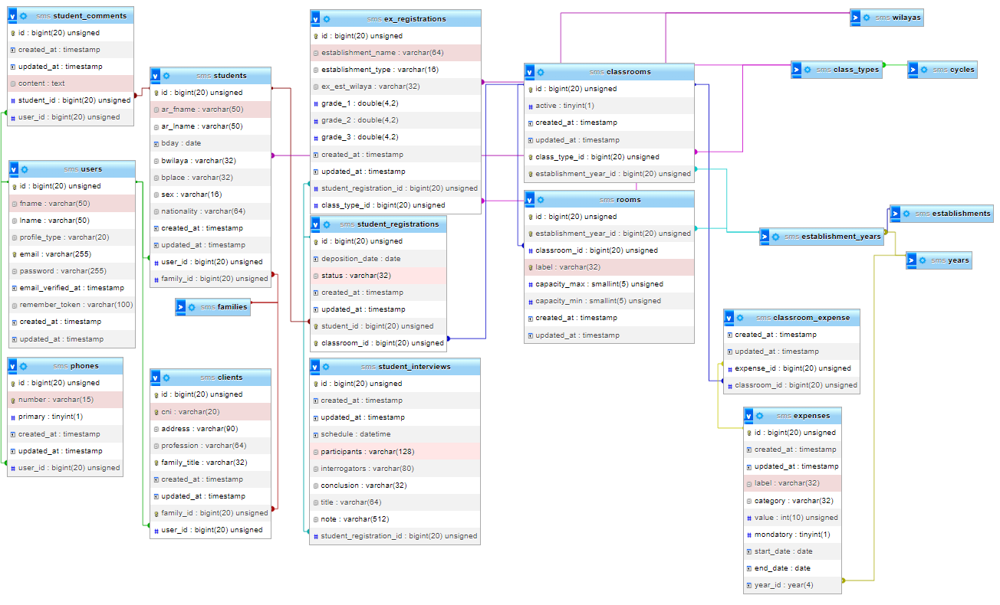

# School Management System

## DB

```text
.(Foundation)
|_.(educational-system)
  |_.Cycles               
    |_.class-types          
|_.(infrastructure)     
  |_.establishments       
  |_.years                
```



The tables **cycles** and **class_types** are seeded with values according to the [algerian educational system](https://education.gov.dz/wp-content/uploads/2015/01/RESTRUCTURATION-DU-POST-OBLIGATOIRE.jpg) to keep data integrity and help in search filtring (joinning).

The creation of an **Establishement** is followed by the creation of records in **establishment_classes** table, that brings all _types_ from **class_types**, and associate them with the **Establishment**.

Admins have to insert a **Year** record then **year_classes** will automatically be filled with rows according to **establishment_classes**.

The **clients** table refers to **parents** :

> Unable to use the word _Parent_ as an eloquent model name. [Ref1](https://laravel.com/docs/8.x/eloquent#table-names) [Ref2](https://www.php.net/manual/en/reserved.php)

```php
class Client extends Model
```

About Laravel naming conventions:

- Only **establishments** & **years** tables do not follow IDs naming convetions.

~~Due to the non-IT background of the app users and their expected laziness we made the choice of not setting **phone** & **email** columns to _unique_ and set them to nullable as much as possible.~~

**WARN**: do not rename tables, that will cuase complications with conventional names like foreign keys `{table}_id` and [constraints names](https://laravel.com/docs/8.x/migrations#renaming-tables-with-foreign-keys).

## Abbreviations

|        |                      |
| ------ | -------------------- |
| rel(s) | relationship(s)      |
| fam(s) | family(ies)          |
| est    | establishment        |
| y      | year                 |
| esty   | establishmentYear    |
| reg(s) | student-registration |
| infra  | infrastructure       |
| bg     | background           |

## Testing

### steps order

1. Authenticate.
2. Factorise.
3. Filter factory data into an array.
4. Do the request.
5. Check db counts.
6. Check db matches.

### Test coverage

...

## TODO

Add a **payments** tables that helps track many payments + customies payments policies per **YearClass**.

> Payments table

> Rename cycle in class_types to cycle_name

> Charts

> PDFs
